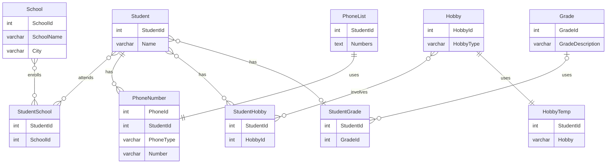

# db2022-Projekt1
Inlämning Projekt1 - Normalisering av databas

## ER-diagram

```mermaid
erDiagram
Student{
int StudentId
varchar Name
}
School{
int SchoolId
varchar SchoolName
varchar City
}
StudentSchool{
int StudentId
int SchoolId
}
PhoneNumber{
int PhoneId
int StudentId
varchar PhoneType
varchar Number
}
Hobby{
int HobbyId
varchar HobbyType
}
StudentHobby{
int StudentId
int HobbyId
}
Grade{
int GradeId
varchar GradeDescription
}
StudentGrade{
int StudentId
int GradeId
}
HobbyTemp{
int StudentId
varchar Hobby
}
PhoneList{
int StudentId
text Numbers
}
Student }o--o{ StudentSchool : attends
School }o--o{ StudentSchool : enrolls
Student ||--o{ PhoneNumber : has
Student }o--o{ StudentHobby : has
Hobby }o--o{ StudentHobby : involves
Student }o--|o StudentGrade : has
Grade |o--o{ StudentGrade : uses
Hobby ||--|| HobbyTemp : uses
PhoneList ||--|| PhoneNumber : uses
```

## Instruktioner
Kör scriptet till databasen
	docker exec -i iths-mysql mysql -uiths -piths < normalizering.sql
