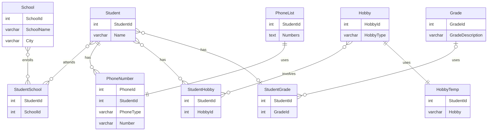

# db2022-Projekt1
Inlämning Projekt1 - Normalisering av databas samt en CRUD i Java

## ER-diagram



## Instruktioner
Kör git clone
```
https://github.com/HannahDJU22/db2022-Projekt1.git
```

Kör scriptet till databasen
```
docker exec -i iths-mysql mysql -uiths -piths < normalizering.sql
```
Om du vill logga in i databasen och kika på ett exempel (*för PC, kom ihåg winpty före docker*)
```
docker exec -it iths-mysql bash

mysql -uiths -piths
```
Skriv SQL-kommando i databasen
```
use iths;

SELECT Name, SchoolName, GradeDescription, HobbyType FROM Student
JOIN StudentSchool USING(StudentId)
JOIN School USING(SchoolId)
JOIN StudentGrade USING(StudentId)
JOIN Grade USING(GradeId)
JOIN StudentHobby USING(StudentId)
JOIN Hobby USING(HobbyId);
```

För att köra CRUD i Java
```
gradle run
```
Kör du gradle run ännu en gång så ser du att StudentId 5  
fått sitt Grade uppdaterat till Supreme  
samt att StudentId 39 raderats från vår lista
