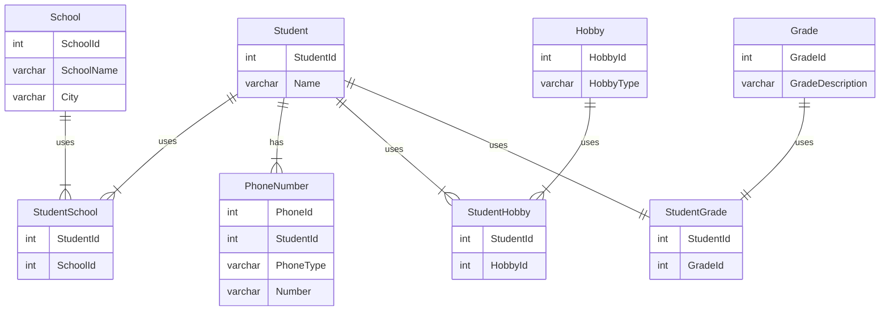

# db2022-Projekt1
Inlämning Projekt1

## ER-diagram

```mermaid
erDiagram
Student {
int StudentId
varchar Name
}
School {
int SchoolId
varchar SchoolName
varchar City
}
StudentSchool{
int StudentId
int SchoolId
}
PhoneNumber{
int PhoneId
int StudentId
varchar PhoneType
varchar Number
}
Hobby{
int HobbyId
varchar HobbyType
}
StudentHobby{
int StudentId
int HobbyId
}
Grade{
int GradeId
varchar GradeDescription
}
StudentGrade{
int StudentId
int GradeId
}
Student ||--|{ StudentSchool : uses
School ||--|{ StudentSchool : uses
Student ||--|{ PhoneNumber : has
Student ||--|{ StudentHobby : uses
Hobby ||--|{ StudentHobby : uses
Student ||--|| StudentGrade : uses
Grade ||--|| StudentGrade : uses
```
