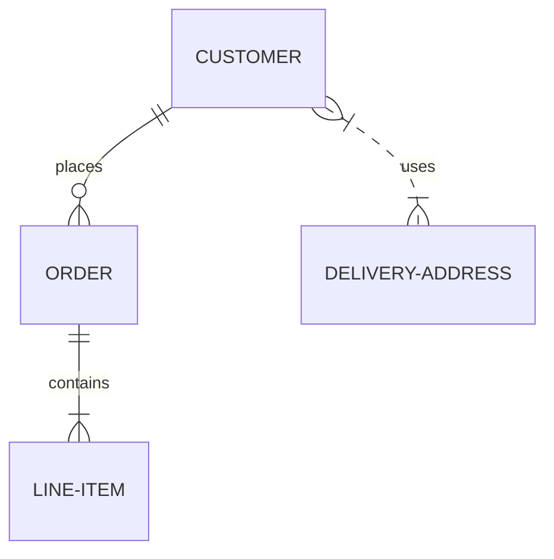

# db2022-Projekt1
Inlämning Projekt1

## ER-diagram


```mermaid
erDiagram
STUDENT ||--o{ StudentSchool : uses
SCHOOL ||--o{ StudentSchool : uses
STUDENT --x PHONENUMBERS : uses
STUDENT ||--|{ HOBBIES : uses
STUDENT }|..|{ StudentGrades : uses
GRADES --> StudentGrades : contains
```
